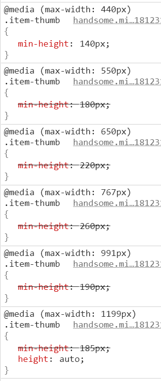
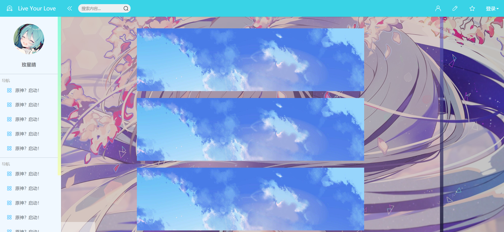

## day9
24.4.14
* 解决了登录的div沉底问题
* 感觉构架差点意思，改天好好想想，scss也有很多没用到的东西
* 图片before蒙版解决了，要在图片外面加一个container然后设置为
```css
position: relative;
```
* 一直在研究怎么缩放图片不拉伸，然后发现框架都是裁好固定大小图片放进去...,然后


今天最后界面是是这个样子


结果又改了半天，恢复到原版又开始折腾

最后样式是
```css
.article-block {
    display: inline-flex;
    width: 100%;
    height: fit-content;
    background-size: cover;
    overflow: hidden;
    margin-left: auto;
    margin-right: auto;
    z-index: -1;
    img {
        overflow: hidden;
        width: 100%;
        min-height: 140px;
        max-height: 260px;
        margin-left: 10%;
        margin-right: 10%;
        object-fit:cover;
        transition: transform 0.3s ease;
        &:hover {
            transform: scale(1.05); 
        }
    }
}
```
